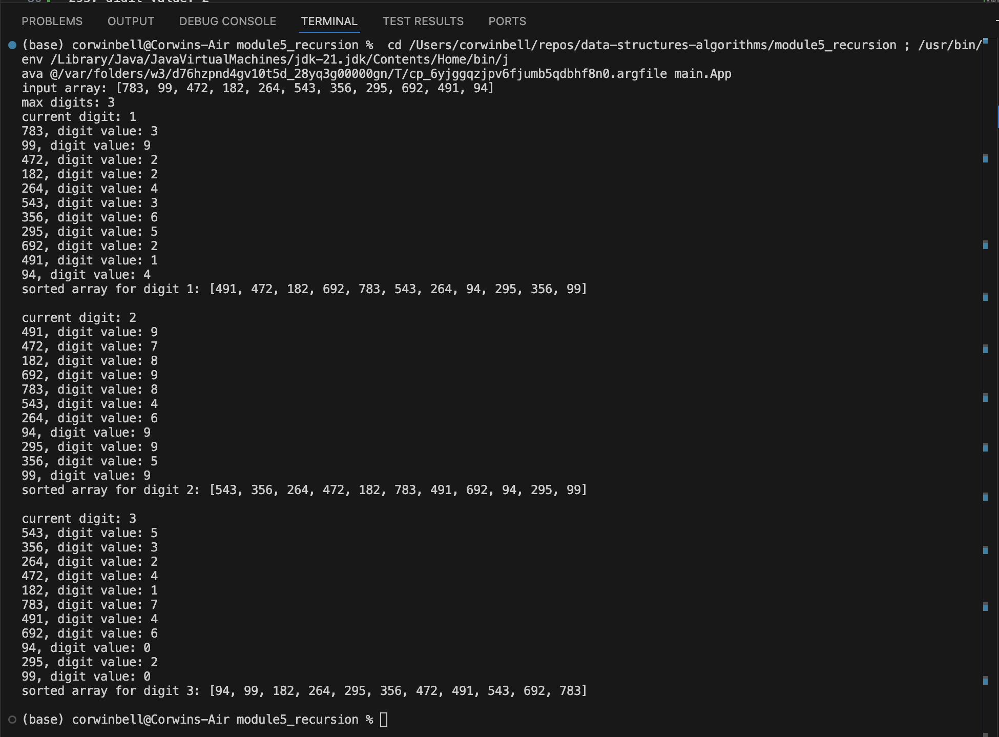

Student: Corwin Bell <br>
Instructor: Santosh Gottipamula <br>
CSC400-1: Data Structures & Algorithms <br>
10/12/2024
# Module 5 Option #1: Radix Sort for Integer Objects
Implement the radix sort algorithm in Java. 

## Time & Space Complexity Analysis
Analyze the algorithm by documenting the steps taken when radix sort sorts the following array of Integer objects: 
Analyze the Big-O of your algorithm.

For this assignment we are tasked with using radix sort on the following array and analyzing the computation space (S) & time (T) complexity of using radix sort. We will use N for complexity proportional to input, m for max number of digits, and 1 for constants.
```python
intArray = [783, 99, 472, 182, 264, 543, 356, 295, 692, 491, 94]
```
The basic pseudocode for my approach looks like this:
```python
determine maxNumberDigits # T = N, S = 1
create sorting array of arraylists with 10 buckets # T = 1
for digit < maxNumberDigits: # T = m, for max number of digits
    for integer in intArray: # T = N, S = N
        put integer in bucket based on its value for current digit

    for bucket in bucketArray: # T = 1
        for integer in bucket: # T = N
            put integer back in intArray # in current digit sorted order
    
    clear bucketArray for next iteration # T = N

return intArray # return a fully sorted array

```
The approximate time complexity T(N) = N + (m * (N + N + 1)) + N = 2N + m(2N + 1) = m2N + 2N + m, thus O(N) since m is a constant.

The approximate space complexity S(N) = 1 + N, thus also O(N).

## Execution Output
The given example has array.length = 11, and maximumDigit = 3, thus must perform the radix sort on 11 items 3 times.
```
input array: [783, 99, 472, 182, 264, 543, 356, 295, 692, 491, 94]
max digits: 3
current digit: 1
783, digit value: 3
99, digit value: 9
472, digit value: 2
182, digit value: 2
264, digit value: 4
543, digit value: 3
356, digit value: 6
295, digit value: 5
692, digit value: 2
491, digit value: 1
94, digit value: 4
sorted array for digit 1: [491, 472, 182, 692, 783, 543, 264, 94, 295, 356, 99]

current digit: 2
491, digit value: 9
472, digit value: 7
182, digit value: 8
692, digit value: 9
783, digit value: 8
543, digit value: 4
264, digit value: 6
94, digit value: 9
295, digit value: 9
356, digit value: 5
99, digit value: 9
sorted array for digit 2: [543, 356, 264, 472, 182, 783, 491, 692, 94, 295, 99]

current digit: 3
543, digit value: 5
356, digit value: 3
264, digit value: 2
472, digit value: 4
182, digit value: 1
783, digit value: 7
491, digit value: 4
692, digit value: 6
94, digit value: 0
295, digit value: 2
99, digit value: 0
sorted array for digit 3: [94, 99, 182, 264, 295, 356, 472, 491, 543, 692, 783]
```

## Execution Screenshot
Here is proof that it ran on my local machine without errors.


